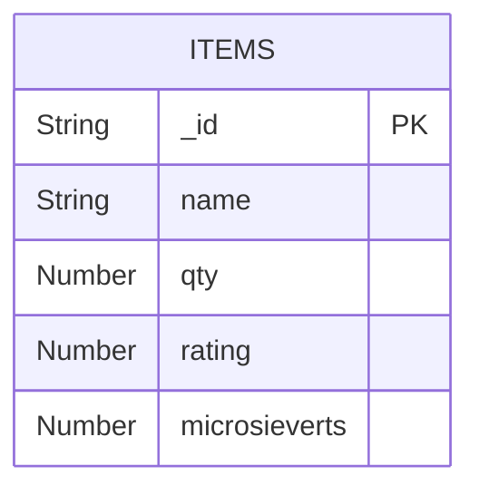

# octopuscs

A simple app for demonstrating the use of docker containers with Node.js and MongoDB.

The home page of the app is destined to display the quantity of apples in the database.

## Prerequisite

Install [docker desktop](https://docs.docker.com/desktop/).

## Run

- Run with:

  ```
  docker-compose up -d
  ```
  
  the application opens at http://localhost:3000/

- To stop the application:

  ```
  docker-compose down
  ```
---

## Visual Demonstration Of The Architecture

### ERD



### Docker Initialization

The [docker-compose.yaml](docker-compose.yaml) pre-defines an architecure of 
images ready to be loaded into containers.
When running the `docker-compose up -d` command, the architecture initiates itself and runs.


### About The Containers

- `mongodb` stores the MongoDB database at http://localhost:27017/
- `mongo-express` may view the database at http://localhost:8061/
- `app` opens at http://localhost:3000/
