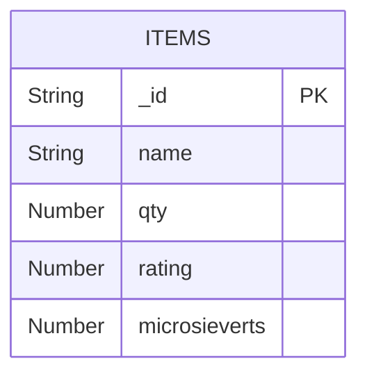

# octopuscs

## Prerequisite

Install [docker desktop](https://docs.docker.com/desktop/).

## Run

Run with:

```
docker-compose up -d
```

the application opens at http://localhost:3000/

---

## Visual Demonstration Of The Architecture



