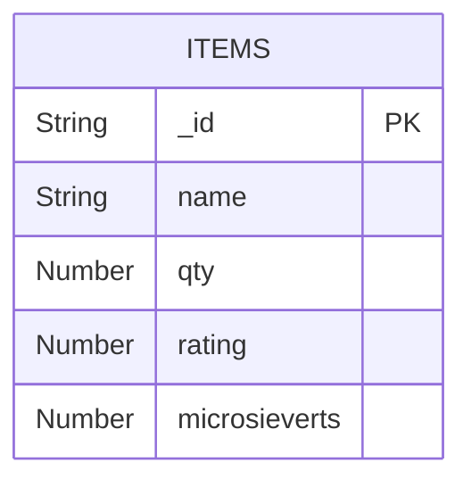
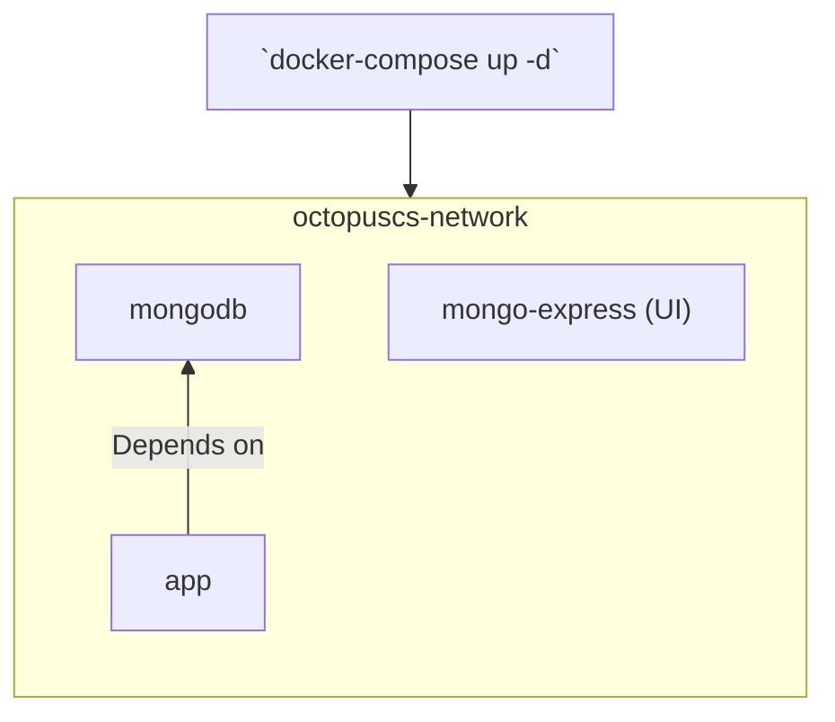

# octopuscs

## Prerequisite

Install [docker desktop](https://docs.docker.com/desktop/).

## Run

Run with:

```
docker-compose up -d
```

the application opens at http://localhost:3000/

---

## Visual Demonstration Of The Architecture

### ERD



### Docker Initialization

The [docker-compose.yaml](docker-compose.yaml) pre-defines an architecure of 
images ready to be loaded into containers.
When running the `docker-compose up -d` command, the architecture initiates itself and runs.
